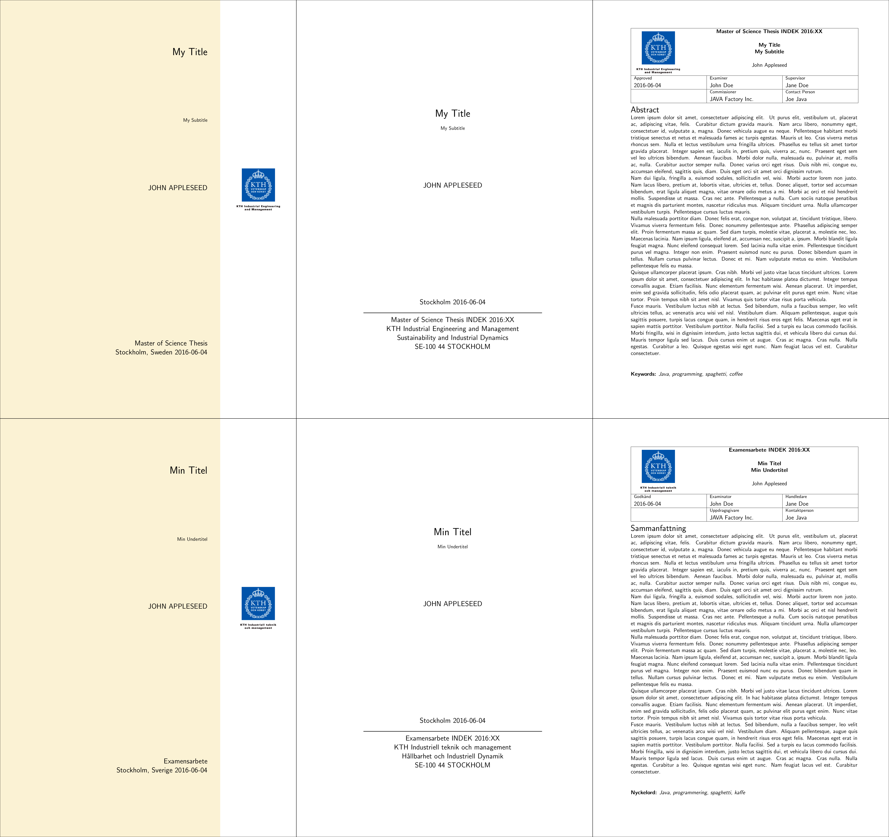

# KTHFrontpage

This is a modified version of the KTHEEtitlepage package (found [here](http://intra.ees.kth.se/en/2.25592/2.25633/latex-1.65629) or [here](https://www.sharelatex.com/templates/thesis/kth-master-thesis-reports)) that I used for my thesis at KTH. This modified version allows for simpler integration into a latex project and multiple title pages can be generated within the same document. Have also included a simple way to generate abstract pages for a thesis. See example.tex for how title and abstract pages can be included in a document. Images for documents not provided.

## Package Description

This is a modified version of the KTHEEtitlepage package, the way of defining options has been changed to support printing several pages in the same document. This package is now not hardcoded for KTHEE. A template for an abstract page has been included also. No copyright infringement intended. Credits belongs to the original authors. Made for educational purposes.

## Package Requirements: 

This package expects the following:

- For option \iprint[forWWW] it expects two image files with the names "kth-logo-colour-eng" and "kth-logo-colour-swe".
- For option \iprint[forPrint] it expects two image files with the names "kth-logo-bw-eng" and "kth-logo-bw-swe".
- If no images are detected or \iprint[noimage] is used, no image will be printed.